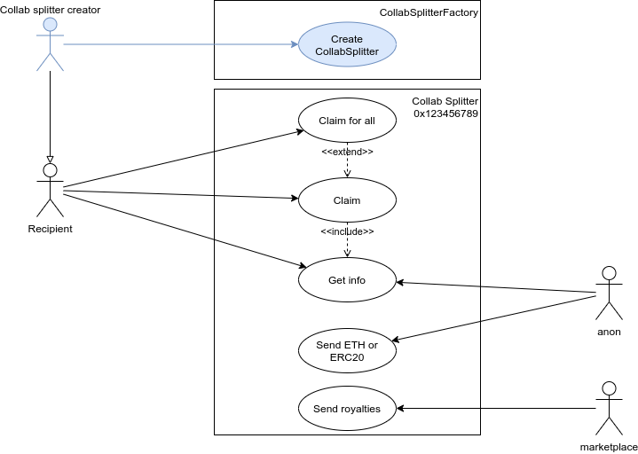

# Collab splitter

Collaboration Splitter allows to create a cheap contract in charge of
receiving and splitting Ethereum and ERC20 payments. It can be used to
split earnings from artworks sales if multiple artists were involved or as
the recipient of royalties compatible with the new [EIP-2981: NFT Royalty Standard](https://eips.ethereum.org/EIPS/eip-2981)

Available on [https://purple-disk-1468.on.fleek.co/](https://purple-disk-1468.on.fleek.co/)

The project has several components:

- **Smartcontracts** (in [`contracts/`](contracts/))
- **The Graph** (in [`graph/`](graph/))
- **SDK** (in [`sdk/`](sdk/))
- **Website** (in [`website/`](website/))

## Usage

Use the SDK or create your contract directly [on the website](https://purple-disk-1468.on.fleek.co/)

### Create a collaboration splitter

In order to create a splitter contract you will need:

- An Ethereum wallet with some ethers (only needed by the splitter creator)
- The list of recipients and their allocations e.g. 13.37%
- A name for your collaboration

Fill out the form, click on the 'Create' button and once your transaction is confirmed and the contract deployed, you will get the address to use for your NFT creations.

### See a collaboration / get info

On this page you can see all the information about a deployed collab splitter.

If you connect your wallet, you will be able to see if you can claim ETH or ERC20.

https://purple-disk-1468.on.fleek.co/collab/0x

### Claim

You can claim **ETH** or the listed **ERC20** from incoming transactions.

You can also claim **individually** or **for all** the contract recipients.

## Installation

Simply run `npm run install:all` or ` npm run install:all:pnpm` if you are using [pnpm](https://pnpm.io/).

This will install all the necessary `node_modules`, to run each component individually please see their respective `README.md` files.

## Contributing

Contributions are always welcome! Feel free to open any issue or send a pull request.
Check out the [contribution guide](CONTRIBUTING.md/) to learn about how to set up !

## License

Collab splitter is released under the [MIT License](LICENSE).
